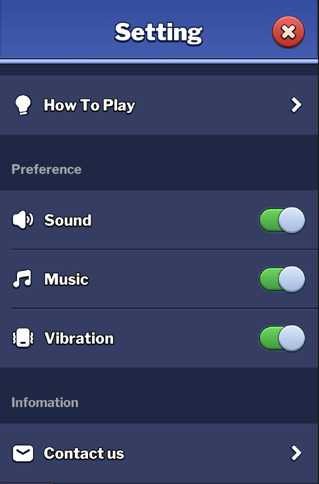
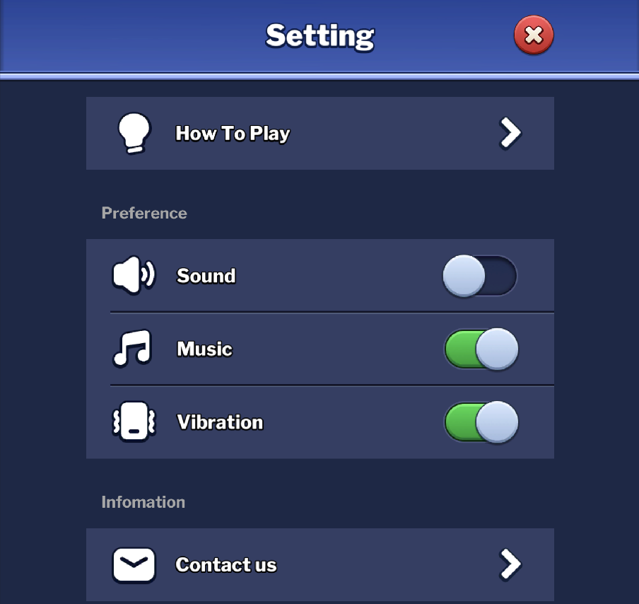
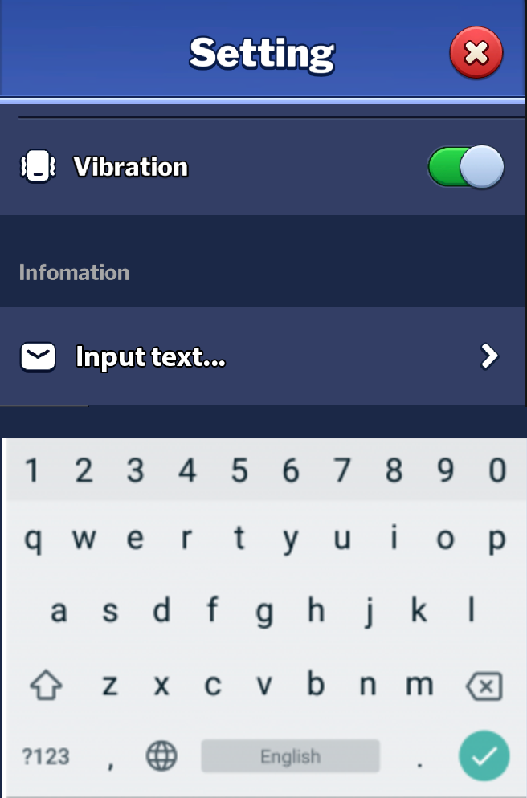

# URP 3D 测试

欢迎参加Unity项目的 `输入框测试`, 此测试旨在测试面试者对于`UGUI`及`Android原生组件`的熟悉程度和实现能力

## 基础要求

1. 请仔细阅读 [README.md](../../../README.md) 的内容，确认你已经了解测试提交的基本规范和要求。

## 试题如下:

1. 请将项目的构建 Platform 切换至 AndroidPlayer
2. 制作 UI 所需要的资源已准备好：
   - Font 字体：`Assets/Art/Font`, 默认字体：`LibreFranklin-Black`
   - UI通用组件：`Assets/Art/Common`
   - Setting页面通用组件：`Assets/Art/Setting`
3. 请打开位于 `Assets/Scenes/SampleScene` 路径 的场景文件. 接下来所有的实现请在该场景内完成。
4. 在场景内, 以为你建立好一个 **UIRoot** 作为根节点挂载所有的 UI 组件
5. 实现一个垂直的滚动列表布局，包含以下需求：
    - 整个滚动列表布局的底色为：`#1B2847`，组件间距 `4px`
    - 列表顶部具备一个 **标题栏** 组件，
      - 组件底色 `#3956AE`，
      - 高度 **172px**
      - 组件不会滚动，固定位置在UI 页面顶部
      - 组件内置一个文本框，字号 **80**，文本初始内容为 `Setting`, 字体颜色为 `#FFFFFF`， 带有描边，描边颜色为 `#000000`, 描边宽度为 `2px`  
      - **标题栏** 右侧具备一个 **关闭按钮** 组件，大小 **200x200**， 位置详见设计图
    - 列表第一个元素是一个 **开关组件** 
      - 元素本身高度为 **200**，左右顶满，含背景色底色 `#333E65` （整体效果可科参考效果图内 **Sound** 组件条）
      - 内部组件由 **左对齐的 Icon** + **标题** + **右对齐的Action图标** 构成
      - 左 Icon 大小 **80x80**，垂直居中，左边距 **40**，图标为：**ic_how_to_play**
      - label 文本字号 **52**，垂直居中，字体颜色为 `#FFFFFF`， 带有描边，描边颜色为 `#000000`, 描边宽度为 `2px`, 和左 Icon 间距 **32**
      - label 文本："Change Title Text"
      - 右 Icon 大小 **168x116**，垂直居中，右边距 **40**，Icon 图片为内部提供的 **ic_switch_on** 及 **ic_switch_off** 两个图片。
      - 整个元素都是可点击区域， 点击后 右侧图标会跟据开关值 **true/false** 进行切换。
      - 点击后额外的功能是会修改 **标题栏** 文本的内容：
        - **true**: "Setting"
        - **false**: "Option"
    - 列表中第二个元素是一个 **开关组件**
      - 外观及布局和第一个元素均相同
      - 左侧图标为：**ic_shock**
      - **label** 文本："Vibration" 
      - 点击后会控制 打开/关闭 按钮的触觉震动反馈
        - 当开关值为 **true** 时：UI 上所有按钮的点击都会触发系统震动反馈（力度： Light）
        - 当开关值为 **false** 时：UI 上所有按钮的点击都不会触发系统震动反馈
    - 列表中的第三个元素是一个 **按钮组件** 
      - 元素本身高度为 **200**，左右顶满，含背景色底色 `#333E65` （整体效果可科参考效果图内 **How to Play** 组件条）
      - 左 Icon 为 **ic_message**
      - 右 Icon 大小 **72x72**，垂直居中，右边距 **40**，Icon 图片为内部提供的 **ic_arrow** 图片。
      - Label 默认的文字为 “Input text...”
      - 整个元素都是可点击区域， 点击后会拉起一个系统输入法的界面
      - 同时整个 ScrollView 组件需要上移，使得最后一个元素下边缘位于系统输入法组件顶端上方，间距 **15px** （参考 **图3** 的效果）
      - 系统输入确认后，元素的 lalbel 文本变为用户输入的文字
6. **整体适配**
    - 页面需要利用 Unity 或者原生接口支持刘海屏，摄像头和底部菜单条的适配
    - 默认页面均为竖屏。
    - 页面需要适配 **手机** 和 **平板** 的分辨率，并应用不同的布局, 效果可参考 **图1** 和 **图2**
    - 特别说明：Pad 适配的时候，有特殊需求：
      - 要求页面的 **标题栏** 的底板左右顶满，内容宽度为屏幕整体宽度的 **75%**， 关闭按钮的右边距按此宽度调整
      - 要求滑动栏的宽度，占屏幕总宽度的 **75%**， 内部元素高度不变，内部组件对齐方式不变，每个元素的长度自适应拉伸。
7. 为测试震动效果，请提供构建好的 **Apk** 文件作为交付物

## 样例参考：

### 图1：手机适配效果

### 图2: Pad 适配效果

### 图3: 输入框示意图

---

## 实现要求
- 所有文档提及的功能点都可以覆盖，无遗漏点。
- 程序运行时无 BUG 异常, 无内存泄漏, 不会崩溃
- 程序效率要`高`.
- UI 适配需完善
- 调用原生组件符合预期
- 如果发现了题目有误或者BUG, 请立即更新到 `<个人文件夹>/FEEDBACK.md` 内. 有加分.
- APK 包名: `com.guru.interview.test.inputbox`